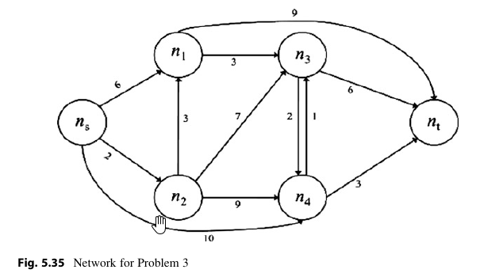

1. Consulta Eiselt, H. A., Sandblom, C. (2010). Operations Research: A  Model-Based Approach. Germany: Springer Berlin Heidelberg, sección 5.3.
2. Replantea el problema 3 del libro Eiselt & Samblont, capítulo 5, como un problema de flujo con costo mínimo.
3. Resuelve el problema utilizando pywrapgraph.SimpleMinCostFlow()
   de Google OR Tools.
4. Verifica si tu respuesta es equivalente a la que da el libro. En caso de que no sea así, discute las posibles explicaciones.
5. Transcribe tu solución en DataLore y comparte el enlace al trabajo de tu equipo. 

